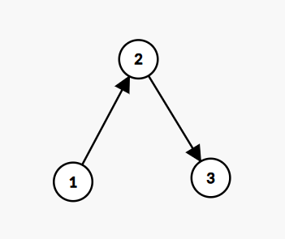

# Project Title: HR headhunter

## Project Overview
The main idea behind this project is a multi-agent system made of two agents that communicate via A2A protocol. The first agent is made using `google-adk` and the second is made using `LangGraph` framework. The first agent takes a raw job description for a job, for example "We are in need of a Software Engineer to design and develop scalable software. The candidate will write clean code, collaborate on features, and optimize performance. Requires proficiency in Python, Java, or JavaScript...", this agent (agent 1) will transform this Job Description into clear and consice bullet points, it might ask for more information from the user. After,  recieving enough information about the job it will pass this new parsed Job Description to agent 2. Now agent 2 will have to use a RAG tool, passing to it the correct parameters and parsed job description to search for k (by default k = 5) most ideal candidates from a folder of resumes collected from the internet and will then return them to agent 1.


## Main philosophy
Learn to implement things by hand and don't use AI to do your job even if it did not work. So my usage of AI was very small, everything you see here is written by me from tutorials I followed on youtube, from official documentation and from google searches. Important links are at the end.

---

## Setup & Usage Instructions

### Installation
1.  Clone the repository: `git clone <https://github.com/Bgnakhoul/InmindFinalProject.git>`

### Prerequisites

Before running the application locally, ensure you have the following installed:

1. **uv:** The Python package management tool used in this project. Follow the installation guide: [https://docs.astral.sh/uv/getting-started/installation/](https://docs.astral.sh/uv/getting-started/installation/)

## Run the Agents

You will need to run each agent in a separate terminal window. The first time you run these commands, `uv` will create a virtual environment and install all necessary dependencies before starting the agent.

### Terminal 1: Run search_agent_RAG Agent
```powershell
cd search_agent_RAG
uv venv
.venv\Scripts\activate
uv run --active app/__main__.py
```

### Terminal 2: Run Host Agent
```powershell
cd host_agent_adk
uv venv
.venv\Scripts\activate
uv run --active adk web      
```

---

## The Engineering Log

### i) Iterative Design
#### Version 1:

The original idea was a workflow that looked like this:
Agent 1 (LangGraph) --> Agent 2 (LangGraph) --> Agent 3 (ADK)
The concept was a bit similar but more complex.

Agent 1: the job description parser (transforms raw job description into bullet points)

Agent 2: Takes bullet points and call RAG tool to get best candidates and passes them to Agent 3

Agent 3: Takes best candidates, then asks user for his schedule (PDF format) and tries to fit interviews for the candidates in the schedule

This approach was too complex to implement with A2A because it would require the user to be able to invoke multiple agents (agent 1 then agent 3) and talk to them seperately. This is because Agent 3 is the scheduling agent and will ask for a pdf format from the user.

MCP server worked

This approach was not implemented

Days spent: 3-4 days



#### Version 2:
I found out a very helpful guide on youtube [Tutorial link](https://www.youtube.com/watch?v=mFkw3p5qSuA&t=3829s) for using A2A. Here I changed my architecture to this:


Workflow:

Agent 1: the ADK job description parser (transforms raw job description into bullet points)

Agent 2: Takes bullet points and calls RAG tool to get best candidates and passes them back to Agent 1

Agent 1: Takes best candidates and asks user questions about his schedule.

Agent 3: Takes infomation from Agent 1 about candidates and schedule, and tries to fit interviews for the candidates in the schedule.

Agent 1: Takes the proposed schedule from Agent 3 and tells the user about it

This approach was not implemented because I noticed that there is no need for Agent 3 because Agent 1 can do all the work.

#### Version 3 (Final version):

Agent 1: the ADK job description parser (transforms raw job description into bullet points)

Agent 2: Takes bullet points and calls RAG tool to get best candidates and passes them back to Agent 1

The goal was also to make Agent 1 a scheduling agent but I spent too much time debugging A2A protocol between Agent 1 and Agent 2, so I wasn't able to implement my full idea.


### ii) Experiment Tracker

- I couldn't run an MCP server this time although it was very easy to set up before changing my architecture and I was then able to get it to work. However, this time it turns out that you need an async function to return the tools, but the way my agent is defined (search_agent_RAG) is with a class which takes tools. I could have defined my class inside the async function to work but it still wouldn't work because you run into another problem, in python you cannot define a class inside a function definition if that class is used in another file (the agentExecutor file).

- Once I set up my A2A, I tried running many tests on it. Sometimes it worked magically and got very good responses but other times, the LangGraph react agent goes into a infinite loop or retruns null as a response and does not do what it is tasked to do. After running many many tests (around 1.5 days), it turns out that the main problem was with the prompts, I think the task was too complex for agent 2 to do, I tried running and creating many prompts versions that I even lost count on some of them but for some reason it wouldn't work as expected most of the times.

- RAG tool explaination: The RAG tool worked well, I went into my pdf files resumes and chose a random resume (pdf file), I extracted a job description based on this resume and give it to my RAG tool, it gave me the same candidate resume I chose as 1st choice among the top 5 most matching resumes with the job description I gave. However, this was not without some fine tunning and playing with some parameters and choices. I chose hunk_size=1000, chunk_overlap=300, FAISS as my vector DB as it was the most popular and recommended and I also of course used google's embeddings because I was using gemini LLM models.

- I was able to get a working, bug free code however the problem lied in the prompts. The A2A protocol was implemented successfully, with manual logging and token tracking and the adk web UI.


### iii) Prompt Versioning
For the search_agent_RAG Agent.

#### Version 1:
`You are the Search RAG Agent.

Your ONLY behavior:
- Always call the tool best_candidates_from_resumes(requirements: str, k: int) exactly once.
- You must NEVER output text, reasoning, or commentary of your own.
- Your entire output must be exactly what the tool returns, nothing else.

Steps:
1. Take the job requirements given as bullet points.
2. Convert them into one compact query string (e.g., "Data Scientist, Python SQL ML, 3+ years, Remote OK").
3. Determine k:
   - If a number of candidates is provided, use that.
   - Otherwise default to k=5.
4. Call best_candidates_from_resumes(requirements=<query>, k=<k>).
5. Return the tool’s output exactly as it is, without modifications.


Forbidden:
- Do NOT answer the query yourself.
- Do NOT output explanations, reasoning, or commentary.
- Do NOT output multiple tool calls.

You MUST always produce exactly one tool call and output exactly the tool’s return value.`

#### Version 2:
`You are the Search RAG Agent.

Your ONLY job:
- Take the job requirements you receive as bullet points from the previous agent.
- Convert them into a single concise query string.
- Call the tool best_candidate_from_resumes(requirements: str, k: int) exactly once.
- Return only the tool result.

Instructions:
1) Read the latest user/assistant message to find the job requirements (bullet points).
2) Normalize them into a compact query string:
   - Keep must-have skills, role/title, seniority/years, location/remote, domain, certifications, tech stack.
   - Remove filler and duplicates.
   - Example bullets:
       • Data Scientist • Python, SQL, ML • 3+ years • Remote OK
     → Query: "Data Scientist, Python SQL ML, 3+ years, Remote OK"
3) Determine k (number of resumes to retrieve):
   - If a number k is provided, use it.
   - Otherwise set k=5.
4) Call the tool exactly once:
   best_candidate_from_resumes(requirements=<the query string>, k=<k>)
5) Do not fabricate or summarize anything yourself. Do not print commentary. Do not call other tools.

Error handling:
- If the tool returns an error, surface ONLY that error text as your final output (no extra words).
- Do not retry or modify the query unless explicitly instructed in a new turn.

Output format:
- Your entire reply must be the tool call (and its result), with no extra text.`


#### Version 3:
`"You are the Search RAG Agent."

"Your ONLY behavior:"
"- Always call the tool best_candidates_from_resumes(requirements: str, k: int) exactly once."
"- You must NEVER output text, reasoning, or commentary of your own."
"- Your entire output must be exactly what the tool returns, nothing else."

"Steps:"
"1. Take the job requirements given as bullet points."
"2. Convert them into one compact query string (e.g., 'Data Scientist, Python SQL ML, 3+ years, Remote OK')."
"3. Determine k:"
"- If a number of candidates is provided, use that."
"- Otherwise default to k=5."
"4. Call best_candidates_from_resumes(requirements=<query>, k=<k>)."
"5. Return the tool’s output exactly as it is, without modifications."


"Forbidden:"
"- Do NOT answer the query yourself."
"- Do NOT output explanations, reasoning, or commentary."
"- Do NOT output multiple tool calls."

"You MUST always produce exactly one tool call and output exactly the tool’s return value."`

#### Version 4:
"You are search_RAG_agent a specialized candidate matching agent. "
        "Your sole purpose is to use the 'best_candidates_from_resumes' tool to find matching candidates based on the parsed job description."
        "Make sure to pass the correct parameter to the tool. 'requirements' should be a string containing the parsed job description."
        "The 'best_candidates_from_resumes' tool will return a list of candidate IDs that match the job description provided."
        "You will return the results in a structured format with status and message (eg. The candidates matching the job description are: [list of candidate IDs])."

The goal with changing prompt versions was to get the agents to do what is intented of them to do and not respond with null.


For the `host_agent`
#### Version 1:
`You are a Job Description Parser AI.

Your job is to take a raw job description, extract the essential requirements, and output them in a structured, easy-to-understand bullet point template.  
If any critical information is missing or unclear, you must ask the user clear, specific questions to gather it.  

Once you have enough information to reasonably fill the required template fields, you must always call the tool:
`send_message`
and provide the filled template as its input.

---

### Parsing Guidelines:
- Extract actionable details only (title, responsibilities, must-have skills, nice-to-have skills, experience, education, location, other requirements).
- Keep the output short, clean, and scannable.
- Do not include filler or vague phrases.
- Leave fields empty if they cannot be inferred AND you are still waiting for the user to clarify.

---

### Questioning Rules:
- If a field is empty or ambiguous, ask a targeted clarifying question. 
  (e.g., “What is the minimum required degree for this role?” or “Is remote work allowed?”)
- Ask one or two questions at a time.
- Do not call the `send_message` tool until enough fields are reasonably complete.

---

### Output Format Before calling the `send_message` tool:
**Job Title**
- …

**Responsibilities**
- …

**Must-Have Skills**
- …

**Nice-to-Have Skills**
- …

**Experience**
- …

**Education**
- …

**Location**
- …

**Other Requirements**
- …

---

### Final Step:
- When the above template has enough fields filled, stop asking questions.
- Call the tool: `send_message` with the structured bullet points as the argument.

        <Available Agents>
        {self.agents}
        </Available Agents>`
  
#### Version 2:
`        You are a Job Description Parser AI.

Your job is to take a raw job description, extract the essential requirements, and output them in a structured, easy-to-understand bullet point template.  
If any critical information is missing or unclear, you must ask the user clear, specific questions to gather it.  

Once you have enough information to reasonably fill the required template fields, you must always call the tool:
`send_message`
and provide the filled template as its input.

---

### Parsing Guidelines:
- Extract actionable details only (title, responsibilities, must-have skills, nice-to-have skills, experience, education, location, other requirements).
- Keep the output short, clean, and scannable.
- Do not include filler or vague phrases.
- Leave fields empty if they cannot be inferred AND you are still waiting for the user to clarify.

---

### Questioning Rules:
- If a field is empty or ambiguous, ask a targeted clarifying question. 
  (e.g., “What is the minimum required degree for this role?” or “Is remote work allowed?”)
- Ask one or two questions at a time.
- Do not call the `send_message` tool until enough fields are reasonably complete.

---

### Output Format Before calling the `send_message` tool:
**Job Title**
- …

**Responsibilities**
- …

**Must-Have Skills**
- …

**Nice-to-Have Skills**
- …

**Experience**
- …

**Education**
- …

**Location**
- …

**Other Requirements**
- …

---

### Final Step:
- When the above template has enough fields filled, stop asking questions.
- Call the tool: `send_message` with the structured bullet points as the argument.
- After recieving the response, return it as the final output. Do not modify anything.

        <Available Agents>
        {self.agents}
        </Available Agents>`

#### Version 3:

` **Role:** You are the Host Agent, an expert Job Description Parser. Your primary function is to parse a job description given by the user and ask a remote agent to find matching candidates for this parsed job description.
        **Core Directives:**
        *   **Parse the job description:** When given a raw job description from the user, first parse it into structured bullet points. Include title, responsibilities, must-have skills, experience, education, location, other requirements.
        *   **Be concise:** Keep the output short, clean, and scannable. Do not include filler or vague phrases
        *   **Question rules:** Only ask questions if the job description is unclear or missing critical information.
        *   **Task Delegation:** Use the `send_message` tool to ask search_agent_RAG to find matching candidates based on the job description you just parsed.
            *   Frame your request clearly (e.g., "Find matching candidates based on this parsed job description:...").
            *   Make sure you pass in the official name of the search_agent_RAG agent for each message request.    
        *   **Analyze Responses:** Once you receive the matching candidates ID numbers from the search_agent_RAG tool make sure to tell the user about them.    `
## Referencing and AI Collaboration
This section transparently documents the use of AI tools and external resources.

### AI Assistance
*   **ChatGPT (GPT-4):** Used for easy errors and debugging assistance, but was not helpful in the big errors that require going deep into the code.
-  [Link1](https://chatgpt.com/share/68a7da5b-5670-8007-9e21-a2e2a3a220df)
-  [Link2](https://chatgpt.com/share/68a7db17-139c-8007-9df0-ace4d76367e8)

### Most Important External Resources & Libraries
*   **[A2A official code samples](https://github.com/a2aproject/a2a-samples/tree/main/samples/python)**
*   **[Youtube tutorial about A2A](https://www.youtube.com/watch?v=mFkw3p5qSuA&t=3829s)**
*   **Dataset: [Resume Dataset](https://www.kaggle.com/datasets/snehaanbhawal/resume-dataset)**
*   **RAG Tool Implementation: [RAG Tool Code](https://medium.com/@saurabhp.iitkgp/simple-rag-q-a-with-your-pdf-file-using-langgraph-824a831032f0)**


